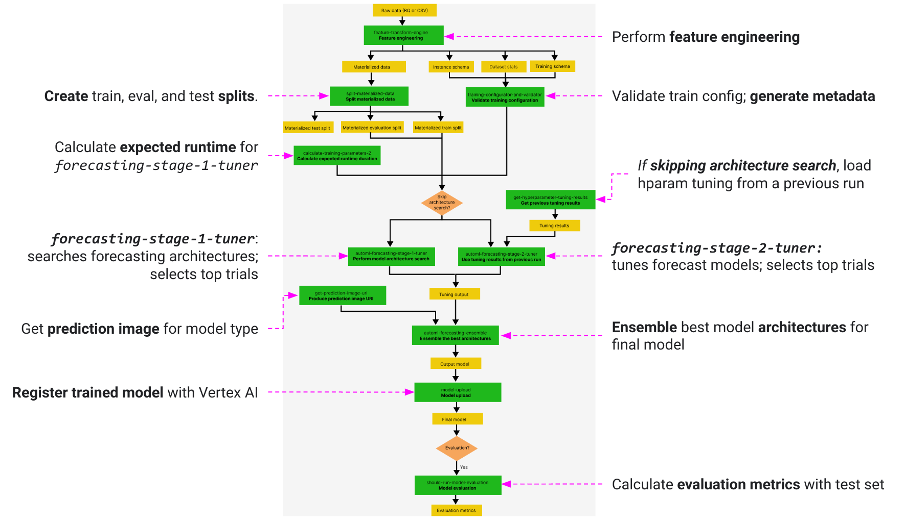
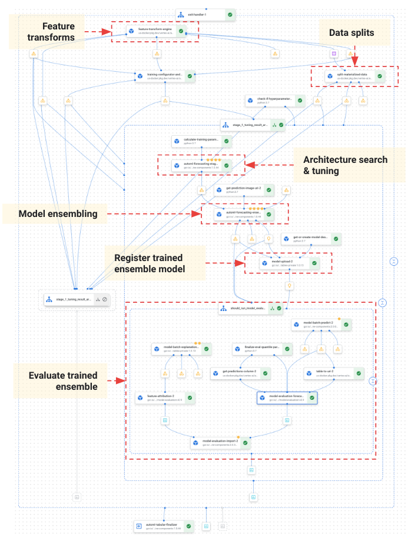

# Forecasting with Vertex Tabular Workflows 

> Use Vertex AI Tabular Workflows pipelines to train Vertex Forecast (AutoML) models using different configurations. Learn more about [Tabular Workflow for Forecasting](https://cloud.google.com/vertex-ai/docs/tabular-data/tabular-workflows/forecasting).

## Why use Tabular Workflows for forecasting?

Vertex Tabular Workflows for Forecasting is the complete pipeline for forecasting tasks. It is similar to the AutoML API, but allows you to choose what to control and what to automate. Instead of having controls for the whole pipeline, you have controls for every step in the pipeline, inlcuding:

* Data splitting
* Feature engineering
* Architecture search
* Model training
* Model ensembling

*[advantages](https://cloud.google.com/vertex-ai/docs/tabular-data/tabular-workflows/forecasting#benefits):*

1. Ability to **improve stability and lower training time** by limiting the search space of architecture types or skipping architecture search
2. Ability to **improve training speed** by manually selecting the hardware used for training and architecture search; control the parallelism of the training process and the number of the final selected trials during the ensemble step
4. For some model training methods, ability to **reduce model size and improved latency** by changing the ensemble size
5. **Supports large datasets** that are up to 1TB in size and have up to 200 columns
6. All pipeline steps, their inputs and outputs, can be viewed in a **pipelines graph interface** (see `TiDE pipeline graph interface` below)


## Overview of pipeline components

*Understanding the modeling pipeline for Tabular Workflow for Forecasting...*

**Recall the AutoML training framework (default):**
* An architecture is defined by a set of hyperparameters
* Hyperparameters include the `model-type` and `model parameters`
* Model types considered include `TiDE`, `TFT`, `L2L`, and `Seq2Seq+`
* In an AutoML job, models are trained for each architecture considered 



**Pipeline components:**
1. **feature-transform-engine**: Perform feature engineering. See [Feature Transform Engine](https://cloud.google.com/vertex-ai/docs/tabular-data/tabular-workflows/feature-engineering) for details
2. **split-materialized-data**: Split the materialized data into training, evaluation, and test sets
3. **training-configurator-and-validator**: Validate training configuration and generate the training metadata
4. **calculate-training-parameters**: Calculates expected runtime duration for `automl-forecasting-stage-1-tuner`  
5. **get-hyperparameter-tuning-results** - *Optional:* If pipeline configured to **skip the architecture search**, loads the hyperparameter tuning results from a previous pipeline run
6. Perform model architecture search and tune hyperparameters (**automl-forecasting-stage-1-tuner**) or use the hyperparameter tuning results from a previous pipeline run (**automl-forecasting-stage-2-tuner**)
7. **get-prediction-image-uri**: Get correct prediction image URI based on the [model type](https://cloud.google.com/vertex-ai/docs/tabular-data/forecasting/train-model#training-methods)
8. **automl-forecasting-ensemble**: Ensemble the best architectures to produce a final model [GitHub src](https://github.com/kubeflow/pipelines/blob/master/components/google-cloud/google_cloud_pipeline_components/preview/automl/forecasting/forecasting_ensemble.py)
9. **model-upload** - Upload the model
10. **should_run_model_evaluation** - *Optional:* Use the test set to calculate evaluation metrics

## TiDE pipeline graph interface

> *sample pipeline for full AutoML training*




## Code Snippets

*Code examples highlighting Tabular Workflow Forecasting capabilities...*


### Skip architecture search
---

The `automl-forecasting-stage-1-tuner` ([src](https://github.com/kubeflow/pipelines/blob/master/components/google-cloud/google_cloud_pipeline_components/preview/automl/forecasting/forecasting_stage_1_tuner.py)) pipeline step is resonsible for performing model architecture search and tuning hyperparameters. To skip architecture search, pass the hyperparameter tuning config from a previous pipeline run to the pipeline parameter `stage_1_tuning_result_artifact_uri`:

```python

(
    template_path,
    parameter_values,
) = automl_forecasting_utils.get_time_series_dense_encoder_forecasting_pipeline_and_parameters(
    ...
    stage_1_tuning_result_artifact_uri=stage_1_tuning_result_artifact_uri,
)
```

### Skip hyperparameter tuning
---

The `automl-forecasting-stage-2-tuner` ([src](https://github.com/kubeflow/pipelines/blob/master/components/google-cloud/google_cloud_pipeline_components/preview/automl/forecasting/forecasting_stage_2_tuner.py)) pipeline step tunes AutoML Forecasting models and selects top trials

> TODO: code example

### Transformations
---

You can provide a dictionary mapping of auto- or type-resolutions to feature columns
* Supported types are: auto, numeric, categorical, text, and timestamp.
* pipeline parameter: `transformations: Dict[str, List[str]]`

```python
def generate_transformation(
      auto_column_names: Optional[List[str]]=None,
      numeric_column_names: Optional[List[str]]=None,
      categorical_column_names: Optional[List[str]]=None,
      text_column_names: Optional[List[str]]=None,
      timestamp_column_names: Optional[List[str]]=None,
    ) -> List[Dict[str, Any]]:
    if auto_column_names is None:
      auto_column_names = []
    if numeric_column_names is None:
      numeric_column_names = []
    if categorical_column_names is None:
      categorical_column_names = []
    if text_column_names is None:
      text_column_names = []
    if timestamp_column_names is None:
      timestamp_column_names = []
    return {
        "auto": auto_column_names,
        "numeric": numeric_column_names,
        "categorical": categorical_column_names,
        "text": text_column_names,
        "timestamp": timestamp_column_names,
    }

transformations = generate_transformation(auto_column_names=features)
```

### Configure hardware
---

(Optional) Custom configuration of the machine types and the number of machines for various training stages:
* `stage_1_tuner_worker_pool_specs_override: Optional[Dict[str, Any]]` 
* `stage_2_trainer_worker_pool_specs_override: Optional[Dict[str, Any]]`

See GitHub [src](https://github.com/kubeflow/pipelines/blob/master/components/google-cloud/google_cloud_pipeline_components/preview/automl/forecasting/utils.py#L460)

```python
worker_pool_specs_override = [
  {"machine_spec": {"machine_type": "n1-standard-8"}}, # override for TF chief node
  {},  # override for TF worker node, since it's not used, leave it empty
  {},  # override for TF ps node, since it's not used, leave it empty
  {
    "machine_spec": {
        "machine_type": "n1-standard-4" # override for TF evaluator node
    }
  }
]
```

### Retrieve the uploaded Vertex model with a Vertex Pipeline job id
---

**Example format of pipeline_job_id:** `projects/540160140086/locations/us-central1/pipelineJobs/tide-forecasting-de601790-4a65-400d-96f8-a22c0b6756a1`

```python
pipeline_job_id` = "projects/540160140086/locations/us-central1/pipelineJobs/tide-forecasting-de601790-4a65-400d-96f8-a22c0b6756a1"
job = aiplatform.PipelineJob.get(pipeline_job_id)
pipeline_task_details = job.gca_resource.job_detail.task_details
upload_model_task = get_task_detail(
    pipeline_task_details, "model-upload-2"
)

forecasting_mp_model_artifact = (
    upload_model_task.outputs["model"].artifacts[0]
)
forecasting_mp_model = aiplatform.Model(forecasting_mp_model_artifact.metadata['resourceName'])
print(forecasting_mp_model)
```

### Upload with parent model for different model versions
---

```python
parent_model_resource_name = ""
parent_model_artifact = aiplatform.Artifact.get_with_uri("https://us-central1-aiplatform.googleapis.com/v1/" + parent_model_resource_name)
parent_model_artifact_id = parent_model_artifact.gca_resource.name.split("artifacts/")[1]

train_budget_milli_node_hours = 250.0  # 15 minutes

(
    template_path,
    parameter_values,
) = automl_forecasting_utils.get_time_series_dense_encoder_forecasting_pipeline_and_parameters(
    project=PROJECT_ID,
    location=REGION,
    root_dir=root_dir,
    target_column=target_column,
    optimization_objective=optimization_objective,
    transformations=transformations,
    train_budget_milli_node_hours=train_budget_milli_node_hours,
    # Do not set `data_source_csv_filenames` and
    # `data_source_bigquery_table_path` if you want to use Vertex managed
    # dataset by commenting out the following two lines.
    data_source_csv_filenames=data_source_csv_filenames,
    data_source_bigquery_table_path=data_source_bigquery_table_path,
    weight_column=weight_column,
    predefined_split_key=predefined_split_key,
    training_fraction=training_fraction,
    validation_fraction=validation_fraction,
    test_fraction=test_fraction,
    num_selected_trials=5,
    time_column=time_column,
    time_series_identifier_columns=[time_series_identifier_column],
    time_series_attribute_columns=time_series_attribute_columns,
    available_at_forecast_columns=available_at_forecast_columns,
    unavailable_at_forecast_columns=unavailable_at_forecast_columns,
    forecast_horizon=forecast_horizon,
    context_window=context_window,
    dataflow_subnetwork=dataflow_subnetwork,
    dataflow_use_public_ips=dataflow_use_public_ips,
    run_evaluation=False,
    # evaluated_examples_bigquery_path=f'bq://{PROJECT_ID}.eval',
    dataflow_service_account=SERVICE_ACCOUNT,
    # Quantile forecast, TiDE & L2L without probabilistic inference requires
    # as `minimize-quantile-loss` as the optimization objective.
    # quantiles=[0.25, 0.5, 0.9],
)

job_id = "tide-forecasting-with-parent-model-{}".format(uuid.uuid4())
job = aiplatform.PipelineJob(
    display_name=job_id,
    location=REGION,  # launches the pipeline job in the specified region
    template_path=template_path,
    job_id=job_id,
    pipeline_root=root_dir,
    parameter_values=parameter_values,
    enable_caching=False,
    input_artifacts={'parent_model': str(parent_model_artifact_id)},
)
```

#### Integrate Tabular Workflow for Forecasting into your existing KFP pipeline
---

This is implemented using [the pipeline-as-component feature](https://www.kubeflow.org/docs/components/pipelines/v2/load-and-share-components/) of KFP.

```python
from kfp import dsl
from kfp import compiler
from kfp import components


# Number of weak models in the final ensemble model.
num_selected_trials = 5

train_budget_milli_node_hours = 250.0  # 15 minutes

(
    template_path,
    parameter_values,
) = automl_forecasting_utils.get_time_series_dense_encoder_forecasting_pipeline_and_parameters(
    project=PROJECT_ID,
    location=REGION,
    root_dir=root_dir,
    target_column=target_column,
    optimization_objective=optimization_objective,
    transformations=transformations,
    train_budget_milli_node_hours=train_budget_milli_node_hours,
    data_source_csv_filenames=data_source_csv_filenames,
    data_source_bigquery_table_path=data_source_bigquery_table_path,
    weight_column=weight_column,
    predefined_split_key=predefined_split_key,
    training_fraction=training_fraction,
    validation_fraction=validation_fraction,
    test_fraction=test_fraction,
    num_selected_trials=num_selected_trials,
    time_column=time_column,
    time_series_identifier_columns=[time_series_identifier_column],
    time_series_attribute_columns=time_series_attribute_columns,
    available_at_forecast_columns=available_at_forecast_columns,
    unavailable_at_forecast_columns=unavailable_at_forecast_columns,
    forecast_horizon=forecast_horizon,
    context_window=context_window,
    dataflow_subnetwork=dataflow_subnetwork,
    dataflow_use_public_ips=dataflow_use_public_ips,
    run_evaluation=False,
    dataflow_service_account=SERVICE_ACCOUNT,
)

# Load the forecasting pipeline as a sub-pipeline/components which can be used
# in a larger KFP pipeline.
forecasting_pipeline = components.load_component_from_file(template_path)

@dsl.component
def print_message(msg: str):
  print("message:", msg)


# Define a pipeline that follows the below steps:
# step_1(print_message) -> step_2(print_message) -> forecasting_pipeline
@dsl.pipeline
def outer_pipeline(msg_1: str, msg_2: str, ds: dsl.Artifact):
  step_1 = print_message(msg=msg_1)
  step_2 = print_message(msg=msg_2).after(step_1)
  # `vertex_dataset` argument needs to be set/forwarded here to avoid the
  # "missing-argument" error in KFP pipeline.
  forecasting_pipeline(**parameter_values, vertex_dataset=ds).after(step_2)


# Compile and save the outer/larger pipeline template.
outer_pipeline_template_path = "./outer_pipeline.yaml"
compiler.Compiler().compile(outer_pipeline, outer_pipeline_template_path)


job_id = "run-forecasting-pipeline-inside-pipeline-{}".format(uuid.uuid4())
job = aiplatform.PipelineJob(
    display_name=job_id,
    location=REGION,  # launches the pipeline job in the specified region
    template_path=outer_pipeline_template_path,
    job_id=job_id,
    pipeline_root=root_dir,
    parameter_values={'msg_1': 'step 1', 'msg_2': 'step 2'},
    enable_caching=False,
)

job.run(service_account=SERVICE_ACCOUNT)
```