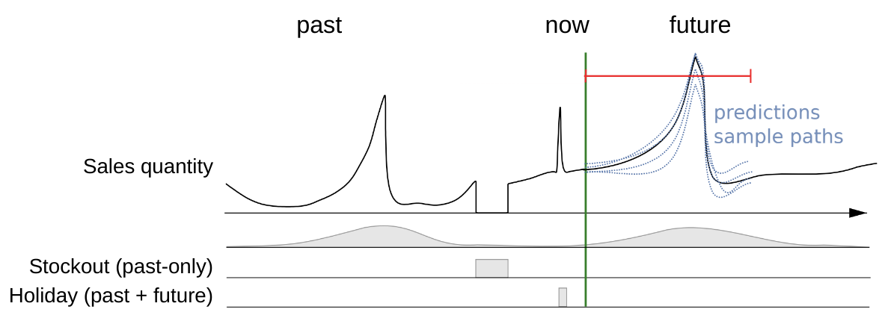
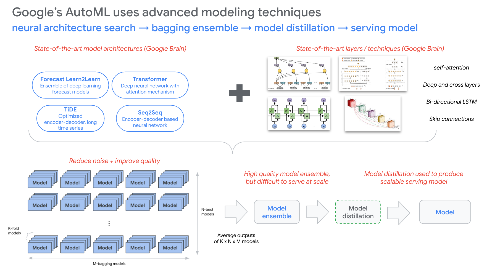

# Demand forecasting with Vertex Forecast and BQML ARIMA+

> this repo provides code examples for various forecasting use-cases using [Vertex Forecast](https://cloud.google.com/vertex-ai/docs/tabular-data/tabular-workflows/forecasting-train) (deep learning AutoML), BigQuery ML's [ARIMA+](https://cloud.google.com/bigquery/docs/reference/standard-sql/bigqueryml-syntax-create-time-series) model, and [Vertex Tabular Workflows](https://cloud.google.com/vertex-ai/docs/tabular-data/tabular-workflows/forecasting) (pipeline orchestration)

### *Note: Currently refactoring repo (12/29/2023)*

* `02-vf-sdk-example/`    - needs updated SDK version
* `03-bqml-sdk-examples/` - up-to-date
* `04-pipeline-examples/` - needs updated versions for SDK and pipeline components
* `05-tabular-workflows/` - **current focus:** consolidating examples; using BQ public dataset

## Getting started

> see the [`knowledge-share`](https://github.com/tottenjordan/vertex-forecas-repo/tree/main/knowledge-share) folder for discussion on select topics

#### (1) Create [Vertex Workbench](https://cloud.google.com/vertex-ai/docs/workbench/introduction) instance; clone repo

from an instance terminal window: `git clone https://github.com/tottenjordan/vertex-forecas-repo.git`

#### (2) Install packages

```bash
pip install -U google-cloud-storage --user
pip install kfp==1.8.19 --user
pip install google_cloud_pipeline_components==1.0.41 --user
pip install--U google-cloud-aiplatform==1.23.0 --user
pip install gcsfs==2023.1.0 --user
```

#### (3) follow data download instructions in `01-download-m5-data.ipynb`

#### (4) follow data validation in `02-m5-dataprep.ipynb` and prepare dataset for forecasting

#### (5) Run example code:

* [02-vf-sdk-examples/](02-vf-sdk-examples/) - Vertex Forecast via SDK
* [03-bqml-sdk-examples/](03-bqml-sdk-examples/) - BQML ARIMA+ and regression; submit SQL through BigQuery python client
* [04-pipeline-examples/](04-pipeline-examples/) - (WIP) Orchestrate Vertex Forecast with Vertex Managed Pipelines
* [05-tabular-workflows/](05-tabular-workflows/) - Train and eval Vertex Forecast models via Vertex AI Tabular Workflows (creates pipelines)


## Vertex Forecast overview

#### Why use deep learning models for forecasting?
* Creates one “global” model for many time series
* Learns patterns across time series

*Can use a large number of drivers across three distinct types of demand influencing factors:*
1. Features that are not time-dependent (e.g., rich metadata such as product attributes, location attributes, etc.)
2. Factors only know up to prediction time (e.g., historical values for inventory, weather, etc.)
3. Factors known in the future  (e.g., planned promotions/events, holidays)



*Can model complex scenarios*
* Cold start / new items
* Short product life cycles
* Burstiness, sparsity
* Unstructured data such as text descriptions
* Feature driven time series


**Model types**
* Time series Dense Encoder (TiDE)
* Temporal Fusion Transformer (TFT)
* AutoML (L2L)
* Seq2Seq+

**Model architecture spotlight: TiDE*
* A new (2023) Google Research model for time series forecasting using multi-layer perceptron architecture.
* Compared to state of art transformer models TiDE has a simpler architecture and same or better accuracy.
* main benefit == efficiency:
  * Massive training throughput improvement: 10x to 30x (especially on longer horizons)
  * Massive prediction throughput improvement: 3x to 10x
  
Find more details and the whitepaper in the research blog post: [Recent advances in deep long-horizon forecasting](https://ai.googleblog.com/2023/04/recent-advances-in-deep-long-horizon.html)

**AutoML forecasting process**



* Neural architecture search (NAS) begins with multiple model types
* With these model types and state-of-the-art layers/techniques (e.g., `self-attention`, `Deep and cross layers`, `Bi-directional LSTM`, `Skip connections`, etc.), VF builds several model architectures of various complexity to compete against each other
* Candidate models are evaluated over multiple trials, where higher performing candidates are promoted to subsequent trials, and less performant candidates are retired
* The highest performing models are trained in a k-fold cross validation, ultimately so that a diverse set of models are produced for the ensembling

**Optimization Objectives** ([docs](https://cloud.google.com/vertex-ai/docs/tabular-data/forecasting-parameters#optimization-objectives))

| Objective  | API                      | Use case |
| :--------: | :------------:           | :------------------------------------- |
| RMSE       | `minimize-rmse`          | Minimize root-mean-squared error (RMSE). Captures more extreme values accurately and is less biased when aggregating predictions.Default value. |
| MAE        | `minimize-mae`           | Minimize mean-absolute error (MAE). Views extreme values as outliers with less impact on model. |
| RMSLE      | `minimize-rmsle`         | Minimize root-mean-squared log error (RMSLE). Penalizes error on relative size rather than absolute value. Useful when both predicted and actual values can be large. |
| RMSPE      | `minimize-rmspe`         | Minimize root-mean-squared percentage error (RMSPE). Captures a large range of values accurately. Similar to RMSE, but relative to target magnitude. Useful when the range of values is large. |
| WAPE       | `minimize-wape-mae`      | Minimize the combination of weighted absolute percentage error (WAPE) and mean-absolute-error (MAE). Useful when the actual values are low. |
| QUANTILE   | `minimize-quantile-loss` | Minimize the scaled pinball loss of the defined quantiles to quantify uncertainty in estimates. Quantile predictions quantify the uncertainty of predictions. They measure the likelihood of a prediction being within a range. |


