# Tips and best practices for planning and executing Enterprise Forecast workloads

### Compared to traditional forecasting methods, deep learning-based techniques introduce several new modeling paradigms that often warrant examining and/or adjusting existing business processes

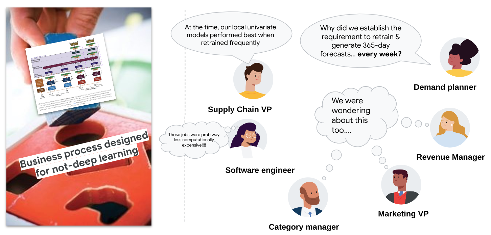

**Problem statements**
* (1) Current established best practices for managing demand forecasting models at scale often implicitly assume that models are local forecasting models (LFM) 
* (2) Current production demand planning pipelines and processes aren't designed to handle high cardinality complex covariate sets.

**Major confounder:** 

*Said best practices are mainly accrued tribal knowledge, very little open source information or formalized definitions and concepts...*

### New Model Paradigm: **global vs local forecasting models**

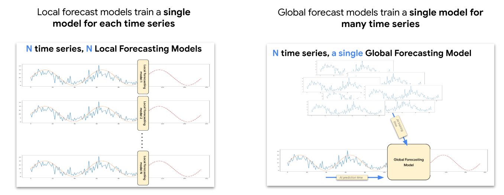

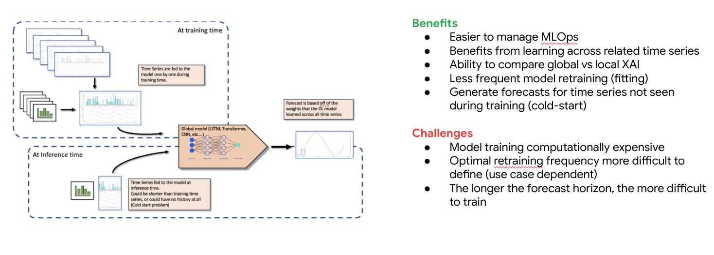

## (1) Forecasting projects are not about using a tool but rather about using your domain knowledge and a tool to make business decisions

> TODO

## (2) Evaluate forecasting with multiple metrics

**Problem:** A proper evaluation metric is crucial in quantifying the progress of a forecasting project and making informed decisions in modeling. Unfortunately, stakeholders and practitioners may pick up an evaluation metric for historical or non-technical reasons, without being fully aware of the implications and limitations of the chosen metrics. Adopting an inappropriate metric can produce *suboptimal models* or even *misleading results* against actual business needs.

Ideally, a high quality evaluation metric should meet the following requirements: 

* **Interpretability**: Results should be easily interpreted by humans (i.e. RMSE and MAE are less ideal).
* **Calculation safety**: The metric should handle zero actuals properly (i.e. MAPE in its original form is less ideal).
* **Fair aggregation**: The metric should aggregate low-volume and high-volume demands fairly.  
* **Stability with number of time series**: Changes in the number of time-series shouldn’t lead to drastically different results.
* **Stability with forecast horizon**: Changes in the length of forecasting horizon shouldn’t lead to drastically different results.
* **Symmetric residual**: The metric should generate symmetric, yet adjustable, error residuals for both over forecasting and under forecasting. Furthermore, such symmetric residuals should hold for both symmetric distributions and asymmetric distributions (e.g. sparse demand). An unbiased estimation of demand at aggregated levels requires symmetric residuals. 
* **Business Friendly**: The metric can be connected with crucial business KPIs such as revenue and profit. 
* **Comparability**: Optionally, the scores from different projects can be roughly compared. 

Usually one metric alone is not enough to evaluate forecast accuracy
* Multiple metrics are required
* Metrics must be scaled metrics (plain RMSE will not do. You must scale it or normalize it to compare against multiple datasets)
* Metrics must be analyzed by sub segments. A single global metric for the entire company is not a valid metric --> segment metrics by various categories in your business to understand how forecasts are performing

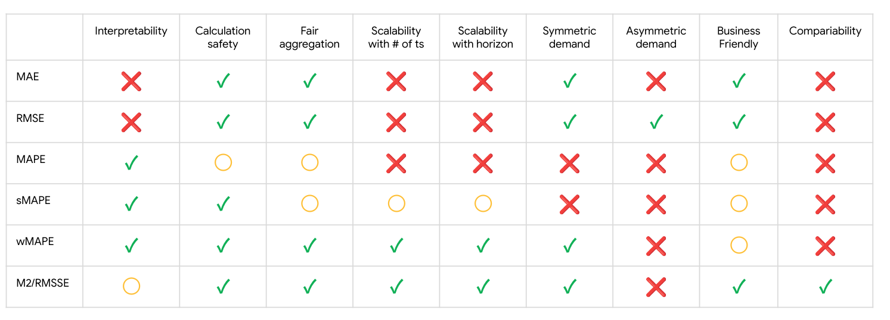

|   Metric      |             Objective            |              guidance                  | 
|   :--------:  |          :------------:          | :------------------------------------- |
| RMSE          | Minimize root-mean-squared error | Captures more extreme values accurately and is less biased when aggregating predictions value. |
| MAE           | Minimize mean-absolute error     | Views extreme values as outliers with less impact on model  |
| RMSLE         | Minimize root-mean-squared log error | <ul><li>Penalizes error on relative size rather than absolute value</li><li>Useful when both predicted and actual values can be quite large</li></ul> |
| RMSPE         | Minimize root-mean-squared percentage error | <ul><li>Captures a large range of values accurately</li><li>Similar to RMSE, but relative to target magnitude</li><li>Useful when the range of values is large</li></ul>  |
| WAPE          | Minimize the combination of weighted absolute percentage error (WAPE) and mean-absolute-error (MAE) |  Useful when the actual values are low |
| Quantile Loss | Minimize the scaled pinball loss of the defined quantiles to quantify uncertainty in estimates |  <ul><li>Quantile predictions quantify the uncertainty of predictions</li><li>They measure the likelihood of a prediction being within a range</li></ul> |

## (3) Allocate more time than usual for EDA and insights
* Since forecasting is all about business, you must plan to spend more time than usual (40% instead of 20% of project time) in EDA and deriving insights about the customers’ data. 
* Your insights about their data will likely lead to better features, so your time spent will lead to better feature engineering in preparation for models.

> TODO

## (4) Perform EDA; adjust historical sales to (better) reflect true demand instead of observed demand
* Spend time understanding your data (e.g. tables and columns); then create hypotheses and validate them with the data. Every plot you make should inform how you model later.
* Sometimes time series dates have gaps (e.g., legacy system omits a SKU’s sales record if 0 qty sold)

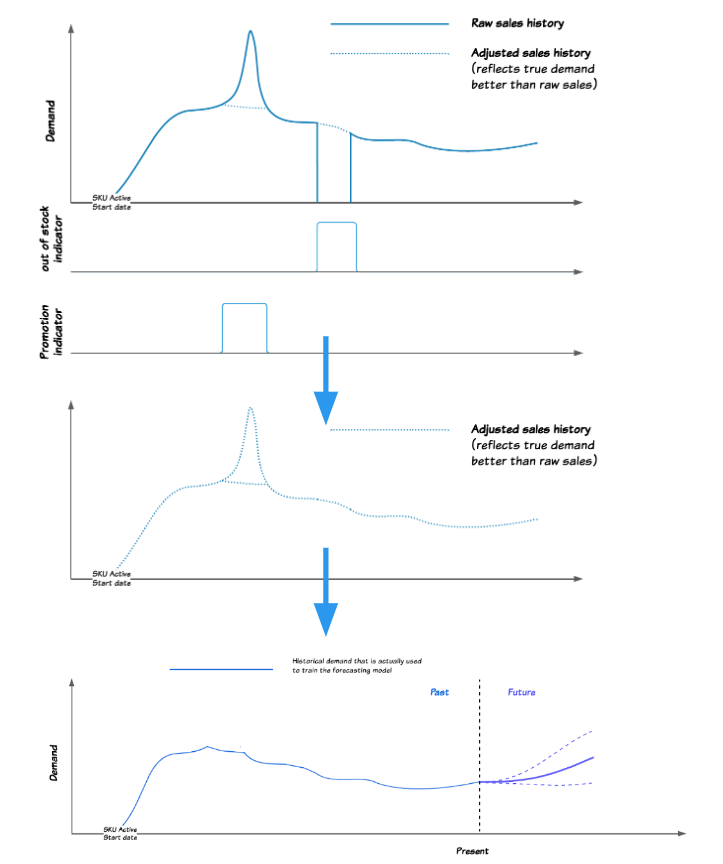

How should we handle?
* zero fill (create record with zero sales)
  * Add feature (e.g., out-of-stock flag)?
* backward fill (from next non-zero value)
* forward fill (from previous non-zero value)

## (5) Categorize your demand patterns

If categorized data does not already align with existing features/columns, create features which categorize them appropriately.

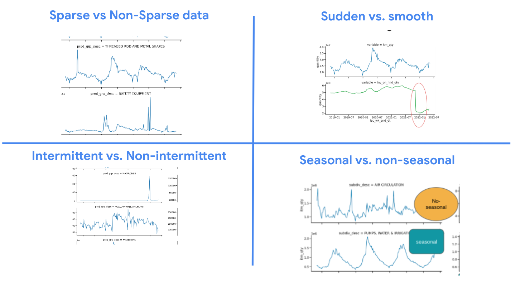

* Sparse vs Non-sparse: Consider separating sparse and non-sparse data if categories are very distinct
* Sudden vs smooth: Create features for smooth & predictable trends, investigate sudden events for outliers, correcting if anomaly
* Intermittent vs non-intermittent: Understand which category your data falls into, and create appropriate optimization/evaluation metrics
* Seasonal vs non-seasonal: Create explicit features which fit to seasonality (can be naive like flags, or complex like sin functions); investigate non-seasonality for cause and correct if necessary
* In some cases, forecast accuracy is greatly improved by removing extremely sparse time series that are essentially unforecastable from the dataset

See this paper, for more on this topic: [categorization of demand patterns](https://www.jstor.org/stable/4102103)

## (6) Establish a core set of features first
* All product hierarchy attributes (e.g., item, category, and division descriptions, etc.)
* A few broad location attributes (e.g., urban vs rural, pop. density, floor plan rather than ZIP, name, etc.)
* Sales (target), inventory (quantity or OOS flag)

**Take advantage of text tokenization:**
* Clean attribute data of special characters (e.g., regex replace)
* Sparse features will do more harm than good (e.g., 3% of time series having `attribute_47`)
* Concatenate product or other hierarchical descriptions together

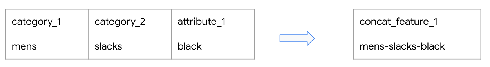

* Considers the interaction of hierarchy all at once
* Reduces need for skip connection between hierarchy levels

**Aggregate features help but caution:**
* Too many numeric features may prevent model from converging well
* When averaging, sums, and lags, ensure they have logic behind them (e.g., creating a 1 year lag because seasonality is strong)
* Do feature engineering after creating train/test/validation splits

## (7) Use unavailable-at-forecast covariates to teach the model about the past

If you don’t have variables available at inference time, don’t panic. These features can still be very useful for your forecast. For example: details on inventory, and shipments/supply can be leading predictors even if future details are unknown. Unavailable at forecast examples:

* Future promotions
* Future prices
* Future holidays
* Future inventory

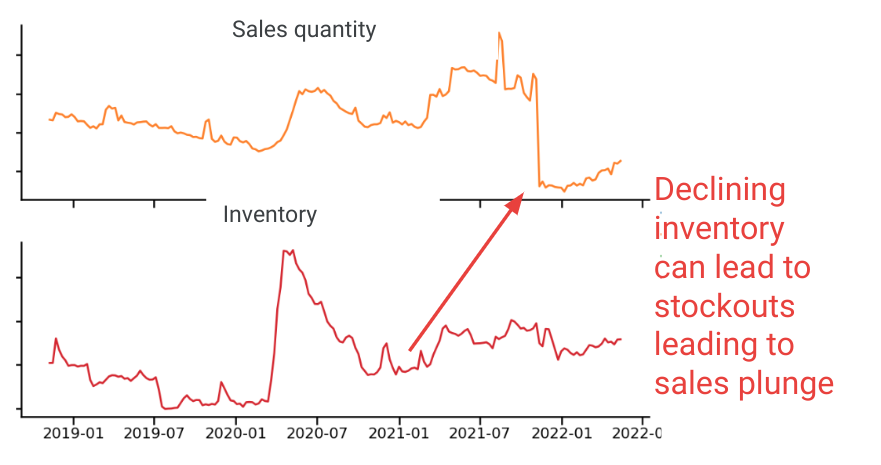

## (8) Use multiple test datasets to determine final metric(s) that will determine model’s future

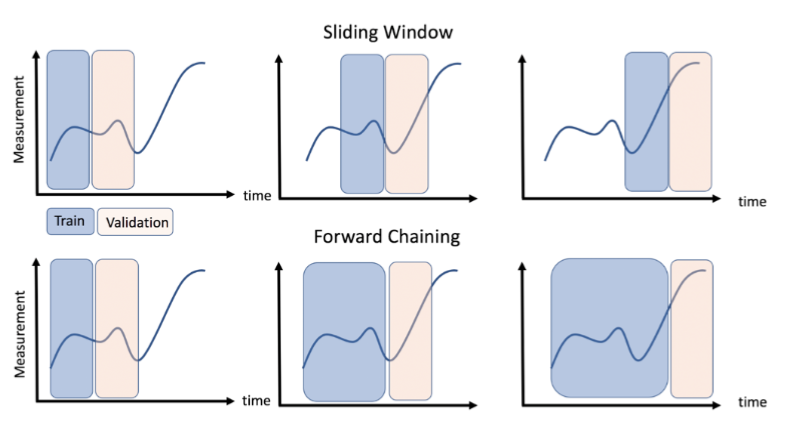

* Don’t evaluate model on a single fixed “golden” dataset
* Instead evaluate model on multiple time slices
* More likely to find a better representation of model’s actual forecast accuracy in production

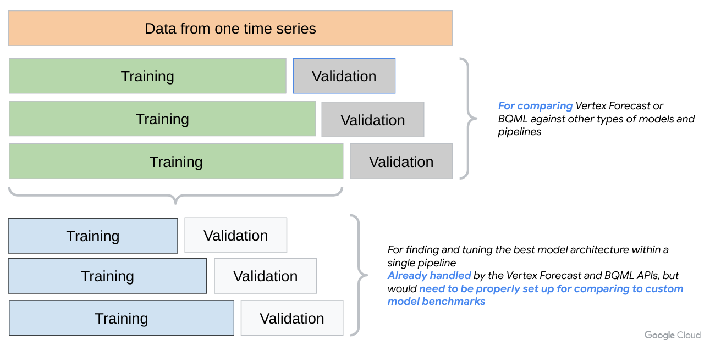

Also, **evaluate model on a sliding window**

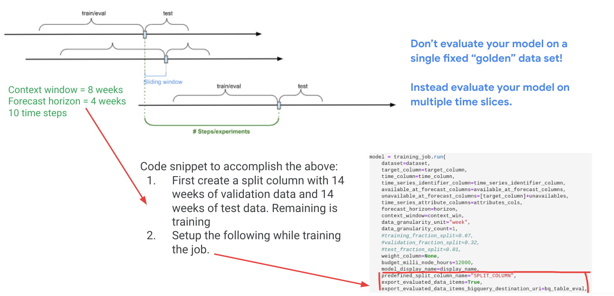

## (9) Pinpoint focus on fewer areas

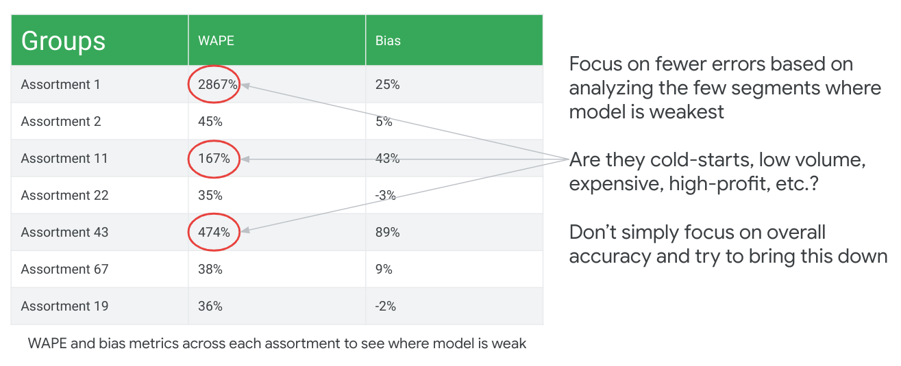

## (10) Learn how lags work: they can have a multiplier effect on your project schedule/plan

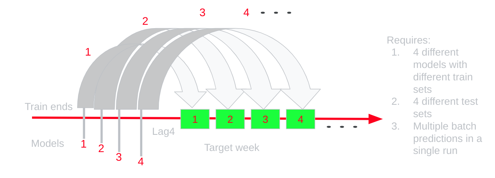

## (11) Perform downsampling when data is too large to fit into Vertex model

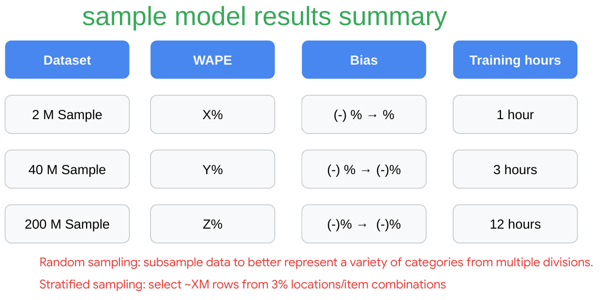

## (12) Use probabilistic inference to improve forecasts

*The premise of Probabilistic Inference is to learn a predictive distribution during training, and infer statistics of the distribution such as the mean and quantiles (including median) during prediction.*

* Provide quantification of uncertainty and efficient tradeoff between metrics using state of the art techniques
* 90:10 and 94:6 are forecasts using a ratio of  (90%*mean prediction + 10%*median prediction)

See [probabilistic-inference-for-intermittent-demand.md](./probabilistic-inference-for-intermittent-demand.md) for more on this topic

