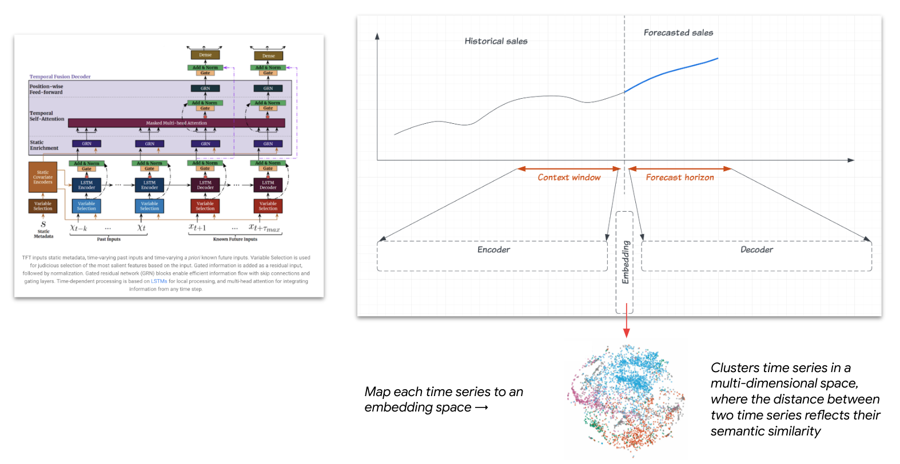
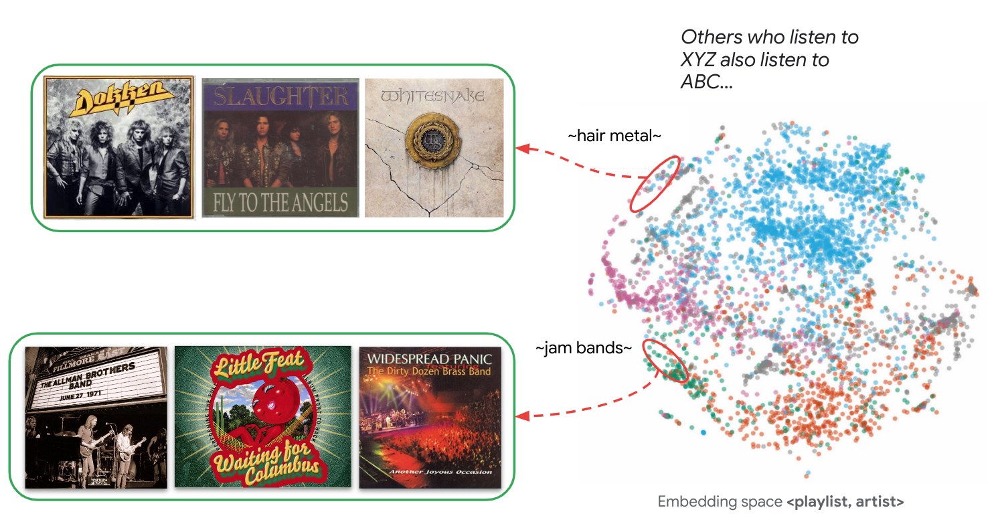
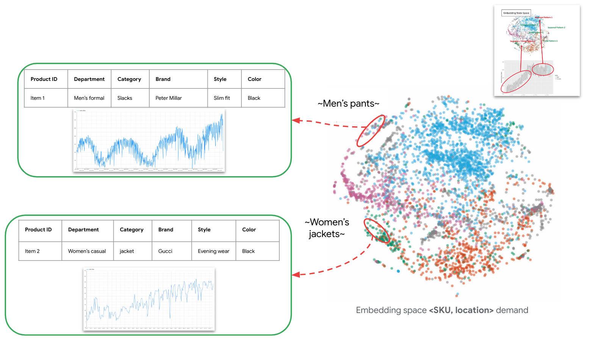
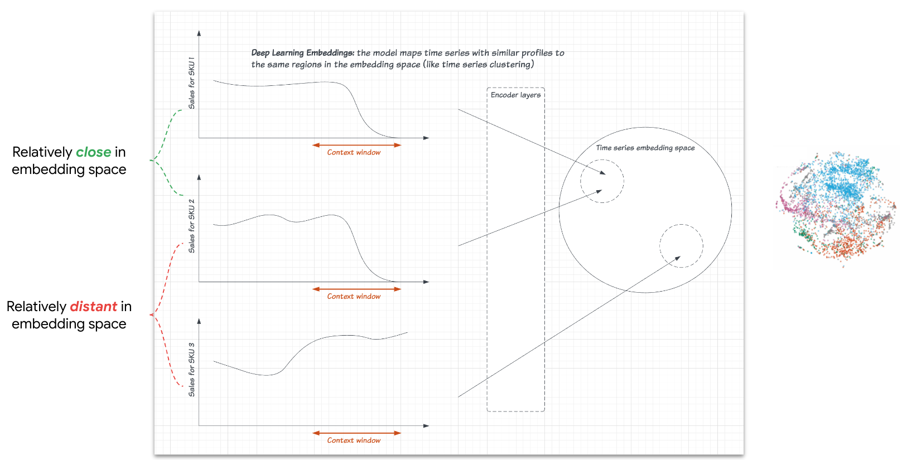
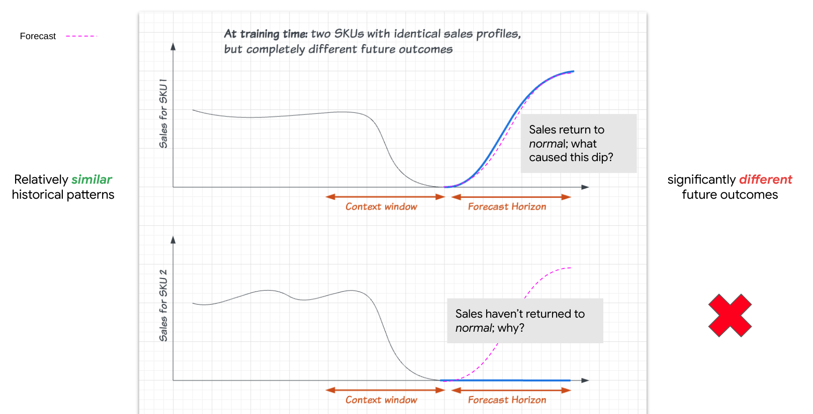
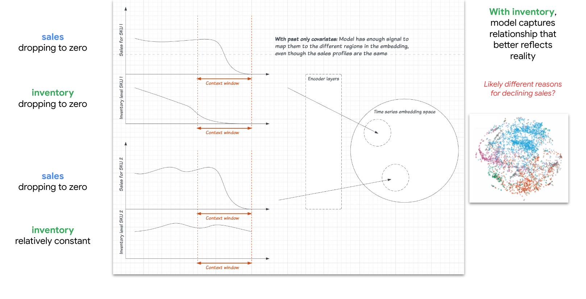

# Intuition behind past-only covariates

## When recommending tracks to users, deep learning models cluster similar artists/tracks by similarity

## We can apply this same concept to deep learning forecast models: they cluster time series by their similarity (e.g., demand patterns, feature representations, etc.)

## So, time series with similar profiles are closer in the embedding space

## But what if the *similar profiles* don’t capture the whole story?
*In this case, adding a feature for inventory reveals these two time series could be dropping for different reasons*

## We create better forecast models with feature sets that better capture reality. 
*In this case, adding a feature for inventory reveals these two time series could be dropping for different reasons*

